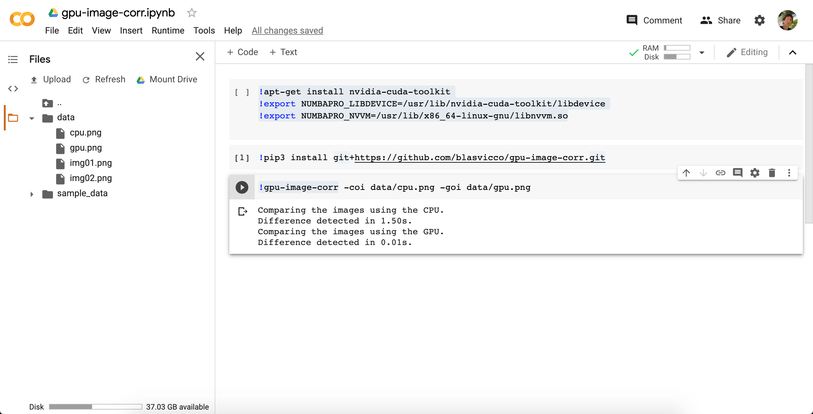
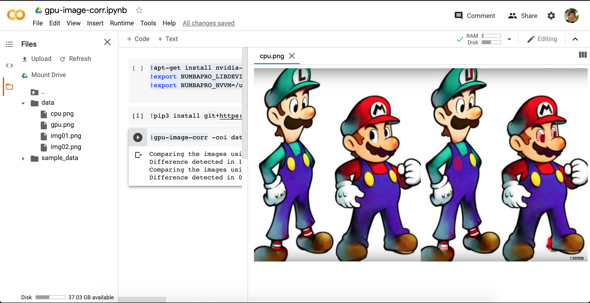

# GPU Image Corr
This is a python script to compare two images of the same size and detect any difference between them.

I developed this script to test time response of image processing using the CPU Vs GPU (parallelization).

The command will require two input images of the same size and it will generate an image output per method used (CPU/GPU).

The output image will be the two input images (one at the side of the other) plus a red box per frame where difference was detected in the image at the right.

### Some of the technologies used in this project are:
  - Python
  - Numba
  - CUDA

### Simple example case:
Given these two image inputs:


Try to find the differences!!!

### Command arguments:
```
ARGUMENTS                  : TYPE                                                         : DEFAULT VALUE
-img1 / --image-01         : string (path to one image)                                   : data/img01.png
-img2 / --image-02         : string (path to the other image)                             : data/img02.png
-f    / --frame-size       : integer (size of the frame / window NxN)                     : 4
-t    / --threshold        : float (threshold used to mark frame as different [0.0, 1.0]) : 0.8
-coi  / --cpu-output-img   : string (cpu output image path / filename)                    : data/cpu_output_img.png
-goi  / --gpu-output-img   : string (gpu output image path / filename)                    : data/gpu_output_img.png
```

### Command call examples:
In order to call the command without arguments, make sure that the data folder is placed in the same path where the command is being triggered.

Using default arguments
```BASH
gpu-image-corr
```

Changing the frame size:
```BASH
gpu-image-corr -f 8
```

Especifying the output file name for both method:
```BASH
gpu-image-corr -coi data/cpu.png -goi data/gpu.png
```

### Online test:
If you don't have an available GPU at home as it is my case you can try https://colab.research.google.com/

First of all, enable the GPU:
- Edit -> Notebook settings -> Hardware accelerator -> GPU

Second, make sure the nvidia cuda toolkit libraries are installed:
```BASH
!apt-get install nvidia-cuda-toolkit
!export NUMBAPRO_LIBDEVICE=/usr/lib/nvidia-cuda-toolkit/libdevice
!export NUMBAPRO_NVVM=/usr/lib/x86_64-linux-gnu/libnvvm.so
```

Third, install `gpu-image-corr`:
```BASH
!pip3 install git+https://github.com/blasvicco/gpu-image-corr.git
```

We are almost there. Before run the command we need to upload some images. You can do that from the file browser section.

In the repo you can find the images I used for testing in the data folder (I hope they don't have copyright).

Last step, just call the command:
```BASH
!gpu-image-corr
```

This is how it looks when you run the command:


This is one of the image being generated:


### Developer notes:
I tried to keep the code as simple as I could. You will notice that pylint standards were applied. There are helpful comments all around.

Methods and variables name are meaningful to make the code super easy to read and follow.

Methods were placed in different files to make them available for their use. So if you want to use any cuda kernel method I developed here, you just need to import them in your script.

### Image processing notes:
In order to compare the input images I'm:
- Framing non overlapping windows of NxN.
- Flattening the frame into a one dimensional vector.
- Calculating the correlation between these two vectors (one per image) using dot product method.
- Checking if the correlation coefficient reach the threshold.

### Real use case:
This library can be use for example for testing purpose. Let's say we need to do a website deployment but we want to check if the changes break any style from our current production site.

Then we can:

1.- Create a list of endpoint we want to test and put them in a txt file, something like:

```
/home
/aboutUs
/contact
...
etc
```

2.- Deploy the new version in a staging environment. So now we have `https://my.page.com` and `https://staging.my.page.com`.

3.- Use any available browser lib to load each endpoint from the list in (1) and capture a full screenshot for the two existing domains.

Example:
```
img01.png = browser.screenshot(https://my.page.com/home)
img02.png = browser.screenshot(https://staging.my.page.com/home)
```

4.- Use this library to correlate the images. If any difference is being detected, then store the endpoint and notify. Cool idea right?!
